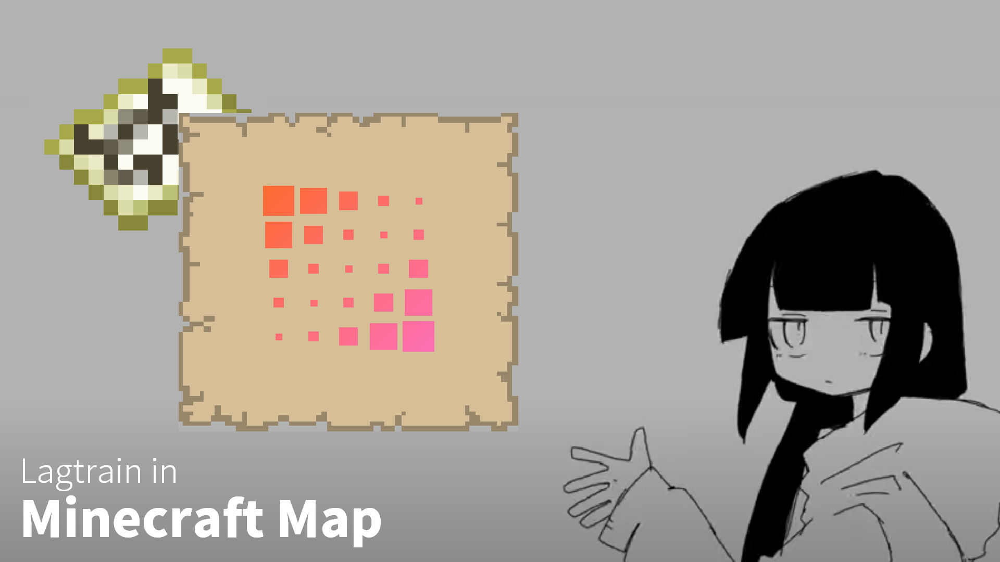

# lagtrain-minestom

A Minestom Server that plays Lagtrain!

## **!!! WARNING !!!**

This server designed for only my youtube video, So it may contains some dirty codes, bugs, and non-efficient algorithm!

## Guides

1. Compile source code using `./gradlew build`
2. Export frames to `(compiled dir)/frames` from lagtrain video using ffmpeg, etc... (The server also can process other videos, but you need to change FPS in the source code to do that)
   - **The format need to be image-%d.jpg**
3. Run the server application
4. Wait for all frames to be processed
5. Connect to 0.0.0.0:25565
6. Execute `/play` command
7. Enjoy in the map!